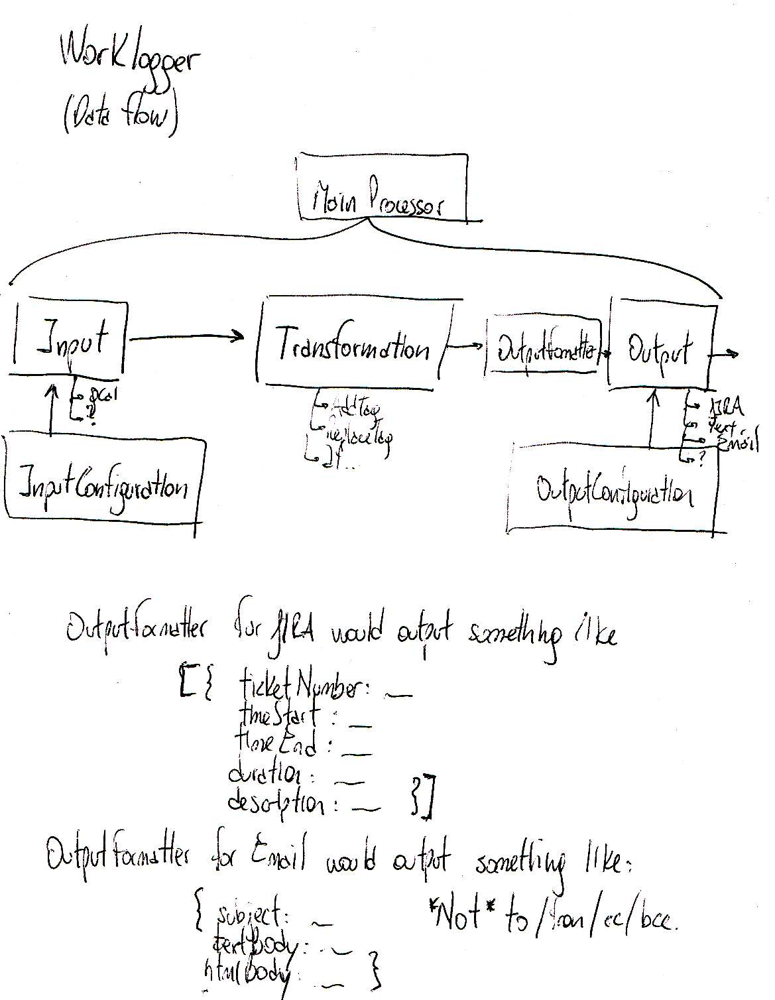

# Worklogger

Detecting logs from different sources and applying them to different outputs.

The particular objective of this system is to allow me to automate my timesheet work, while my clients keep changing the way that they want it logged.

## Rough design

## File naming conventions

- `/docs`: miscellaneous documentation about the project
- `/inputs`: input classes
    - `/input/{inputType}/Input.js`: main entry class for the input
- `/models`: model classes
- `/services`: service classes
- `/tests`: mirror of the design with test classes
- `/outputs`: output classes
    - `/outputs/{outputType}/Output.js`: main entry class for the output
- `/formatters`: formatter classes
    - `/formatters/{outputType}/{formatterType}.js`: main entry class for the formatter. Notice that different formatters will be grouped for a single output.

## Allowing Google Calendar APIs

(Steps from here: https://developers.google.com/google-apps/calendar/quickstart/nodejs)

- Go to https://console.developers.google.com/flows/enableapi?apiid=calendar
- Select / create a project.
- Go to credentials. Cancel.
- Go to OAuth consent screen.
- Select an email address.
- Enter a product name.
- Save.
- Credentials, create credentials, service account key.
- Create a new service account.
- worklogger-bot
- New private key.
- Key type: Json.
- Download.
- Credentials
- Create credentials
- Other (name: Worklogger)
- Ok (no need to copy)
- Download json
- client_secret.json
- save it in the `/_private` folder
