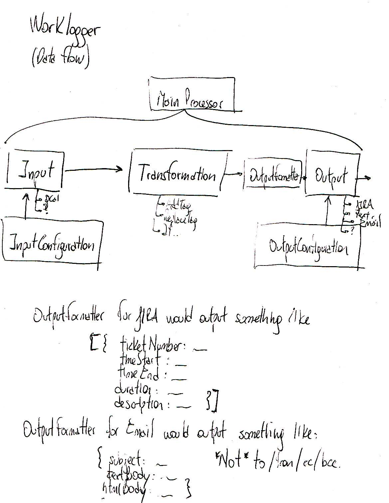

# Documentation

This directory contains all documentation for the Worklogger application. The documentation is organized to mirror the application's structure for easy navigation and maintenance.

## Directory Structure

- [`actions/`](./actions/): Documentation for action components that modify worklogs (e.g., adding/removing tags)
- [`conditions/`](./conditions/): Documentation for condition components used in worklog filtering
- [`formatters/`](./formatters/): Documentation for different output formatting options
- [`inputs/`](./inputs/): Documentation for input sources (e.g., Google Calendar, Harvest)
- [`outputs/`](./outputs/): Documentation for output destinations (e.g., AWS SES, Jira)
- [`services/`](./services/): Documentation for internal services and utilities
- [`config/`](./config/): Documentation for configuration options and formats
- [`models/`](./models/): Documentation for core data models and entities

## Key Documentation

- [Installation Guide](./installation.md)
- [Configuration Guide](./configuration.md)
- [Design Decisions](./design-decisions.md)
- [Docker Containers](./docker-containers.md)
- [Serverless Framework](./serverless-framework.md)

## Architecture

## Helper Scripts

The [`helperScripts/`](./helperScripts/) directory contains documentation for utility scripts used in development and deployment. 